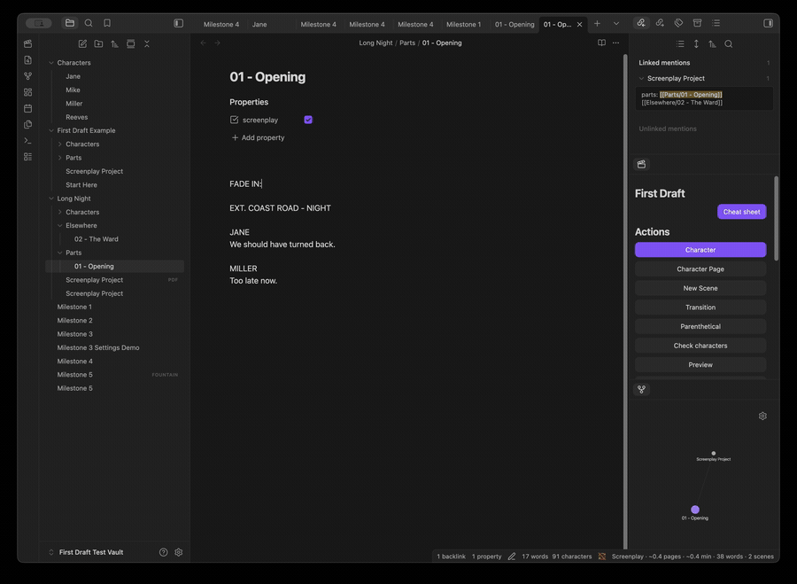

# First Draft

First Draft is an Obsidian community plugin for writing screenplays efficiently
in plain-text [Fountain](https://fountain.io/) syntax.

The guiding principle is simple: think about the movie, not the syntax. First
Draft adds screenplay-aware assistance while keeping every document portable,
human-readable, and useful when the plugin is not installed.



Install First Draft from **Settings → Community plugins → Browse** in Obsidian.
Search for **First Draft**, install it, and enable it. See the
[visual feature tour](docs/FEATURE_TOUR.md) for the complete workflow.

## Features

**0.13.0** adds the scene workspace and read-only continuity inspector described
below. See the [release notes](docs/releases/0.13.0.md) for validation boundaries.

The current build provides:

- screenplay mode for `.fountain` files;
- screenplay mode for Markdown notes with `screenplay: true` frontmatter;
- Fountain-aware scene and character parsing;
- a debounced status item with word and scene counts;
- screenplay-aware estimated pages for US Letter or A4;
- configurable runtime estimation based on minutes per page;
- a current-document statistics dialog with character dialogue rankings;
- parenthetical insertion with common, recently used, and custom choices;
- transition insertion with common, previously used, and custom choices;
- non-destructive export to a clean `.fountain` file;
- non-destructive Final Draft `.fdx` export for the six core screenplay element
  types;
- a read-only, page-like screenplay preview for individual files and combined
  multi-file projects;
- local, non-destructive PDF export in US Letter or A4 with screenplay margins,
  Courier typography, page breaks, and page numbers;
- a dockable First Draft Palette with contextual actions and recent screenplay
  elements;
- a scene workspace with project-wide navigation, filters, portable synopses,
  scene creation and conflict-checked rearranging, including cross-part recovery;
- portable Markdown character dossiers with aliases, screenplay links, and
  relationship links;
- derived per-character scene, cue, and dialogue usage without generated data
  being written into dossiers;
- deterministic character checks for missing pages, duplicate identities,
  ambiguous aliases, broken relationships, unused pages, and likely spelling
  variants;
- a read-only continuity inspector with original-source evidence, explicit
  incomplete-scope reporting and advisory empty-scene/missing-time checks;
- native Obsidian Local Graph access for character relationships;
- ordered multi-file screenplay projects whose parts can live in different
  vault folders;
- vertically stacked project-part links for easier reading and ordering;
- project-wide statistics, character checks, recent elements, autocomplete,
  Fountain/FDX export, and previous/next navigation;
- project-local character folders with a Markdown `character-folder` override;
- a conflict-safe example screenplay generator for first-time exploration;
- an offline, copy-friendly screenplay and Fountain cheat sheet;
- context-aware character, character-extension, scene-location, and time
  autocomplete;
- keyboard-first Character, Character Extension, and New Scene commands;
- settings for activation, autocomplete ranking, result limits, scene types,
  and times of day.

See [PDF compatibility](docs/PDF_COMPATIBILITY.md) and
[FDX compatibility](docs/FDX_COMPATIBILITY.md) for the deliberately narrow
format boundaries.

Open a screenplay or project, then choose **Scenes** in the palette or run
**Open scene workspace** with Cmd/Ctrl+P. See the
[scene workspace guide and test checklist](docs/SCENE_WORKSPACE.md).

**Inspect continuity** provides read-only, source-linked character checks and
scene advice. See the [inspector guide](docs/CONTINUITY_INSPECTOR.md) for its
deliberately limited scope.

First Draft 0.12 embeds a local Courier-compatible PDF font with
broader Latin, Greek and Cyrillic coverage. Missing characters stop export
with a clear diagnostic rather than silently becoming `?`. This is not
universal Unicode support; see the PDF compatibility guide.

The plugin also supports horizontal Chinese, Japanese and Korean
PDFs with an [optional offline Noto font pack](docs/CJK_FONT_PACK.md) and measured
wrapping. Run **Install offline CJK PDF fonts** once on each device that needs
CJK PDFs. Select **PDF language** in First Draft settings for regional character
forms. The core bundle is approximately 2.35 MB and its build enforces a 5 MB
release-asset limit. Preview pagination is approximate; inspect the exported
PDF. Physical-phone font installation and export testing remain important.

### PDF title pages and dialogue continuation

Add an explicit `title` property to a screenplay or project note for an
unnumbered title page. Optional properties are `credit`, `author`, `source`,
`draft-date` (a quoted string), and `contact` (multiline text is supported).
For projects, set these on the project note, not individual parts. Without an
explicit title, PDF export keeps its existing body-only behaviour.

Plain Fountain files can start with:

```fountain
Title: The Long Night
Credit: Written by
Author: Alex Example
Draft date: 1 October 2026
Contact:
    Example office
    Example City

INT. OFFICE - NIGHT
```

The body starts at page 1. Speeches crossing page boundaries get `(MORE)`
and a repeated speaker cue with `(CONT'D)`; short speeches stay together
where possible. These markers appear in preview/PDF only, not in your source.
Oversized title metadata or parentheticals stop export with a clear message.

### Create a screenplay project

Put a project note in the screenplay's folder and list its parts in reading
order. The links resolve using normal Obsidian link rules, so the part files do
not need to share a folder:

```yaml
---
firstdraft: screenplay-project
title: The Long Night
parts:
  - "[[Parts/01 - Opening]]"
  - "[[Elsewhere/02 - The Ward]]"
character-folder: Characters
---
```

`character-folder` is relative to the project note's folder. Start it with `/`
to use a vault-relative folder. Project membership and order come from the
explicit `parts` list.

Parts inside the project note's folder tree are discovered without searching
the whole vault. When a part lives elsewhere, add an explicit project link to
that part's properties:

```yaml
---
screenplay: true
screenplay-project: "[[Long Night/Screenplay Project]]"
---
```

The project note remains authoritative; the part-side link is only a scoped
discovery hint and an ordinary Obsidian backlink.

### Get started with an example

To use your own Markdown note, open it and click the clapperboard ribbon icon.
In the First Draft Palette, choose **Use this note as a screenplay**. This adds
`screenplay: true` to its properties without converting your text or changing
other properties. Writing actions appear once Obsidian updates the note's
metadata. Remove that property to return to ordinary-note mode. If the button
is disabled, enable **Use screenplay frontmatter** in Settings → First Draft.
You can also press **Cmd+P** (Ctrl+P on Windows/Linux) and choose
**First Draft: Use this note as a screenplay** while an ordinary Markdown note
is open.

Run `First Draft: Create Example Screenplay` from the command palette, or use
**Create Example Screenplay** in the First Draft Palette while no screenplay is
open. First Draft creates a new, self-contained `First Draft Example` folder and
opens its `Start Here.md` tour. If that folder already exists, a numbered folder
is used; existing vault content is never overwritten.

Open **Cheat Sheet** in the First Draft Palette—or run
`First Draft: Open Screenplay Cheat Sheet`—for quick screenplay terminology,
selectable Fountain examples, and First Draft project concepts. The cheat sheet
is bundled with the plugin, works offline, and does not create a vault note or
access the system clipboard.

## Development

Requirements: Node.js 22.12+ within the 22 series, or Node.js 24+, and npm.
If you use nvm, run `nvm use` in the
repository before installing dependencies.

```bash
npm install
npm test
npm run lint
npm run build
```

Run `npm run dev` for a watch build.

## Test safely in Obsidian

Never develop against your everyday vault. Build and install into the ignored,
repository-local `First Draft Test Vault` directory:

```bash
npm run test-vault
```

Then open the visible `First Draft Test Vault` directory as a separate Obsidian
vault, enable or reload **First Draft** in Settings → Community plugins, and
open `Long Night/Screenplay Project.md` for project testing or `Milestone 4.md`
for the standalone-screenplay checks.

Expected result:

- the project note lists both ordered parts even though they live in different
  folders, displays each part on its own line, and opens either part from the
  palette;
- project statistics, checks, recent items, and exports combine both parts;
- Previous Part, Next Part, and Project Note navigate the project without the
  command palette;
- creating JANE's page from either project part creates
  `Long Night/Characters/Jane.md` and links it to the project note;
- setting `character-folder: People` on the project changes the destination to
  `Long Night/People`; a leading slash makes the override vault-relative;

- click the clapperboard ribbon icon or run
  `Screenplay: Open First Draft Palette`; the panel opens in the right sidebar;
- move the caret between a character cue, dialogue, and a blank line and confirm
  the highlighted first action changes appropriately;
- click a recent character, parenthetical, or transition to insert it, or click
  a recent location to start a New Scene using that location;
- use **Open page** beside JANE or MILLER, then confirm the dossier shows linked
  screenplay usage, relationships, and an **Open Local Graph** action;
- use **Create page** beside REEVES and confirm First Draft creates
  `Characters/Reeves.md` without modifying the screenplay;
- before creating REEVES, run `Screenplay: Check Characters` and confirm it is
  reported as missing; run it again afterwards to clear that warning;
- open `Characters/Jane.md`, choose **Open Local Graph**, and confirm Jane is
  connected to Milestone 4 and Miller through ordinary wikilinks;
- filter recent items from the panel without losing keyboard focus;
- the status bar shows estimated pages, estimated runtime, words, and scenes;
- run `Screenplay: Show Statistics` to see document totals and dialogue counts
  by character;
- put the caret in dialogue, run `Screenplay: Parenthetical`, and choose a
  common or custom direction;
- run `Screenplay: Transition` on a blank line and choose a common or custom
  transition;
- run `Screenplay: Export to Fountain`; First Draft opens a new sibling
  `.fountain` file with the Obsidian frontmatter removed, leaving the original
  note untouched;
- run `Screenplay: Export to Final Draft FDX`; First Draft creates a new sibling
  `.fdx` file without changing the source. Open that file in Final Draft and
  confirm the scene heading, action, character extension, parenthetical,
  dialogue, and transition retain their element types;
- run `Screenplay: Preview` from a standalone screenplay, a project part, and a
  project note; confirm the project preview combines its parts in order and the
  source remains unchanged;
- export from the preview or run `Screenplay: Export PDF`; confirm the PDF opens,
  matches the configured Letter/A4 size, and a second export uses a numbered
  filename rather than overwriting the first;
- switch page size, minutes per page, or individual status fields under
  Settings → First Draft and confirm the display updates;
- use `Milestone 3 Settings Demo.md` when comparing Letter/A4 or runtime ratios;
  its length makes the differences visible without editing the fixture;
- type `JA` on the final blank line: choose `JANE` with Tab or Enter and start
  typing dialogue on the next line;
- type `INT. MIL`, accept a known location, then accept a time;
- run `Screenplay: New Scene` from the command palette and complete all three
  steps without the mouse;
- put the caret on a character cue and run
  `Screenplay: Character Extension`;
- changing dialogue updates the word count after a short delay;
- removing `screenplay: true` and reopening the note hides the item;
- creating a `.fountain` file activates it without frontmatter;
- ordinary Markdown notes are unchanged.
- from an ordinary note, create an example screenplay; repeat the command and
  confirm the second example uses a numbered folder without changing the first;
- open the cheat sheet from both its command and the sidebar, select one of its
  Fountain examples, and copy it with the normal system shortcut.

To use another dedicated test vault:

```bash
node scripts/install-test-vault.mjs /absolute/path/to/test-vault
```

## Automated testing

`npm test` covers parsing, estimation, helpers, character cataloguing and
verification, derived dossier usage, Fountain/FDX/PDF export, deterministic
screenplay page layout, strict XML parsing, XML escaping, and structural FDX
compatibility. `npm run test-vault` builds the production bundle and installs
it into the isolated vault.

Browser Playwright alone cannot exercise an Obsidian plugin because Obsidian is
an Electron desktop application rather than a website. A separate Electron UI
harness is possible, but it would be platform-specific and more brittle than
the model-level tests. The remaining acceptance check is therefore a short run
in the isolated Obsidian vault; see [FDX compatibility](docs/FDX_COMPATIBILITY.md).

First Draft keeps mobile support enabled. Before the public release, follow the
[mobile testing checklist](docs/MOBILE_TESTING.md) on at least one physical
device and record the Obsidian and operating-system versions used.

## Privacy

First Draft is local-only. It includes no telemetry and needs no network
connection during ordinary use. See [PRIVACY.md](PRIVACY.md).

## Contributing

See [CONTRIBUTING.md](CONTRIBUTING.md). By participating, you agree to follow
the [Code of Conduct](CODE_OF_CONDUCT.md).

Release history is recorded in the [changelog](CHANGELOG.md). Security issues
must be submitted through the private process in [SECURITY.md](SECURITY.md), not
through a public issue.

## Licence

[Apache License 2.0](LICENSE)

Third-party licences are recorded in
[THIRD_PARTY_NOTICES.md](THIRD_PARTY_NOTICES.md).
