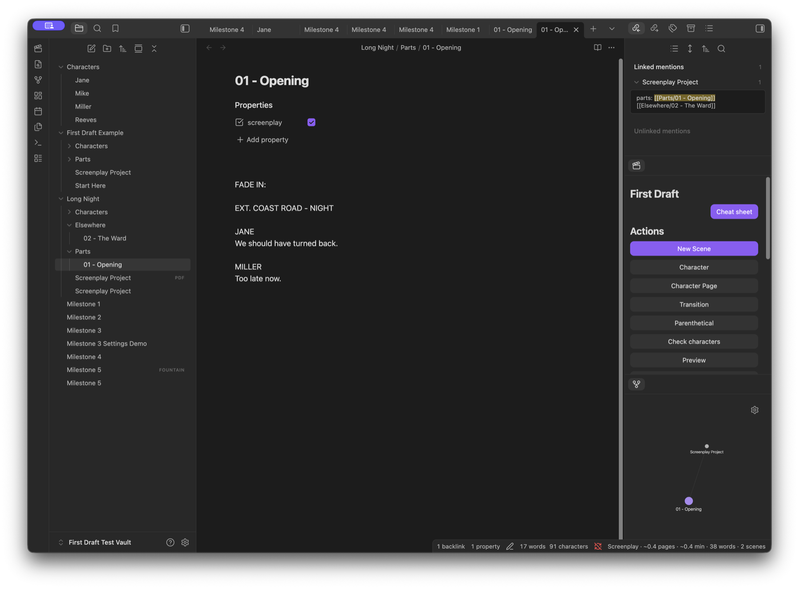
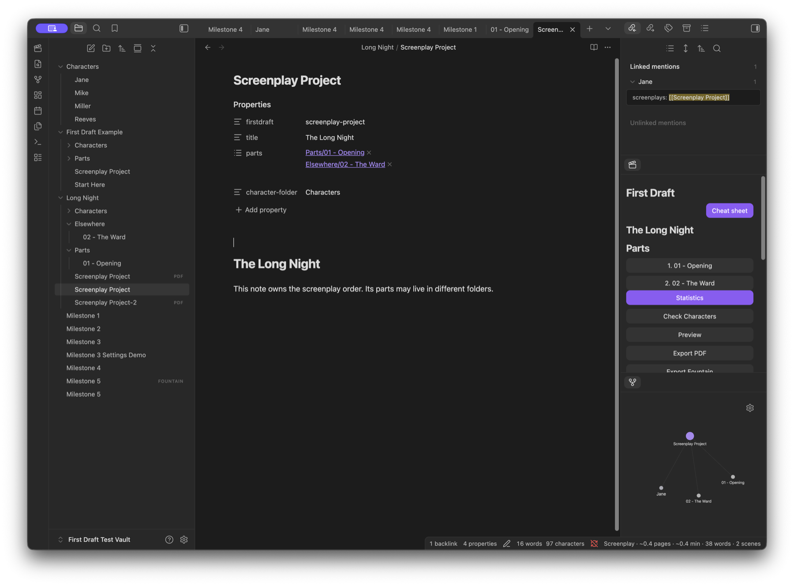
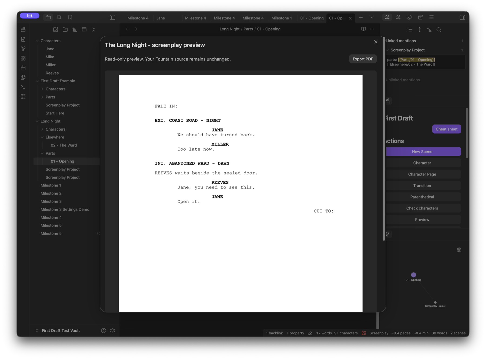
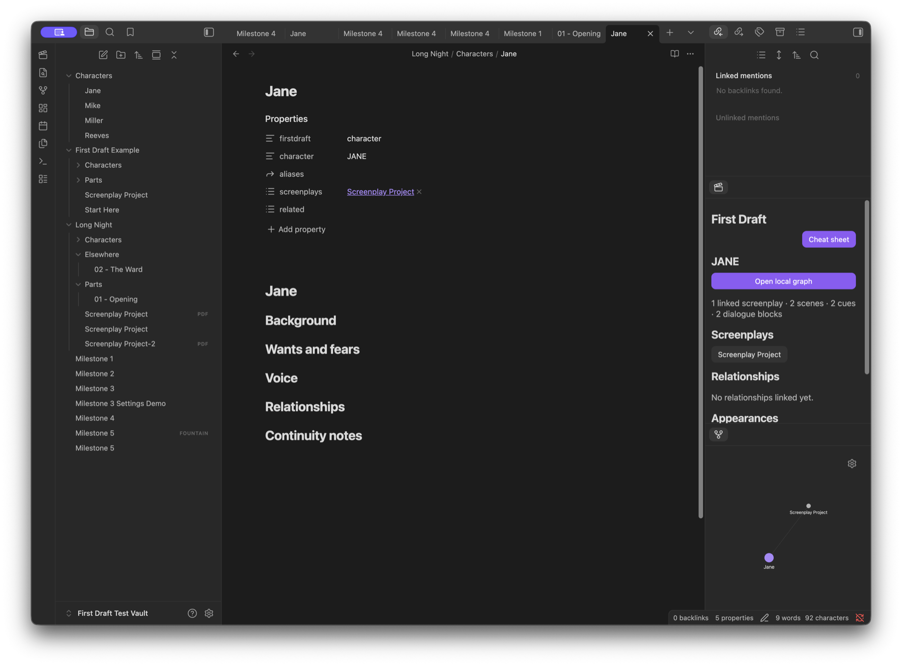
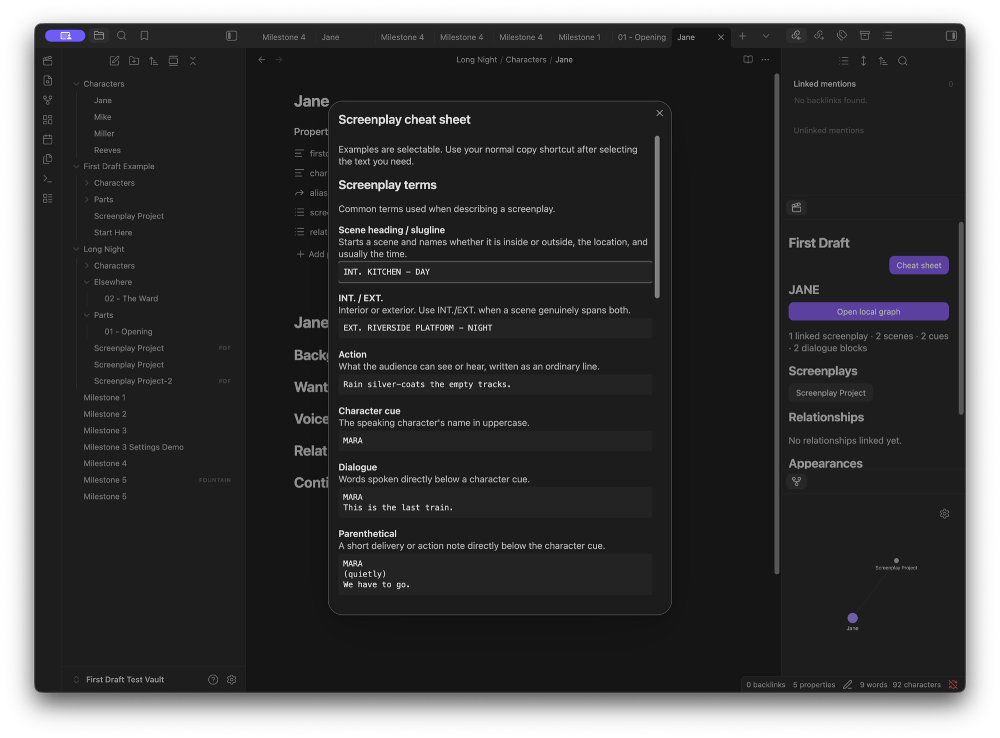

# First Draft feature tour

First Draft keeps Fountain or Markdown as the source of truth and adds a
screenplay-aware workspace around it. Everything shown below runs locally in
Obsidian.

## Write with the quick-access palette

The dockable First Draft palette keeps context-sensitive writing commands,
character pages, project navigation, recent characters, locations,
parentheticals, and transitions beside the editor.

Autocomplete and keyboard-first commands cover scene headings, known
locations, times of day, character cues, character extensions,
parentheticals, and transitions. Statistics in the status bar update while the
source remains ordinary portable text.

## Combine a screenplay from several files

A project note owns the explicit reading order. Parts can live in different
folders, and the `parts` property stays readable one link per line.

Project statistics, checks, recent items, preview, and Fountain, FDX, and PDF
exports operate on the combined screenplay. Previous/next actions move between
parts without the command palette.

## Preview and export a readable PDF

Preview renders the active screenplay or whole project as paper-like pages.
The toolbar exports the same deterministic layout to a new PDF without
changing or overwriting the source.

The configured US Letter or A4 size controls both preview and PDF. See
[PDF compatibility](PDF_COMPATIBILITY.md) for the supported screenplay
elements and intentional production-pagination boundary.

## Keep character context in normal Markdown

Character dossiers hold background, wants, voice, relationships, and
continuity notes. First Draft derives appearances and dialogue usage from the
screenplay and offers the normal Obsidian Local Graph for relationships.

Deterministic checks report missing pages, duplicate identities, ambiguous
aliases, broken relationships, unused pages, and likely spelling variants.
They do not generate or rewrite story material.

## Keep the terminology close

The offline cheat sheet explains screenplay terms, Fountain syntax, and First
Draft project concepts. Its examples are selectable and use the normal system
copy shortcut; the plugin itself does not access the clipboard.

## Try it safely

Run **Create example screenplay** from the First Draft palette or command
palette. It creates a self-contained tour with a project, parts, and character
dossiers. Existing vault content is never overwritten.

The 13-second [preview and PDF demo](images/firstdraft-demo.mp4) is also
available as a compact video.
